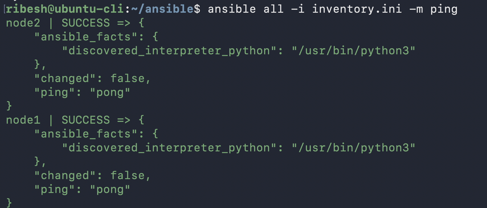
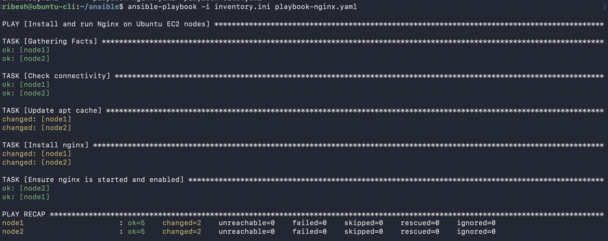
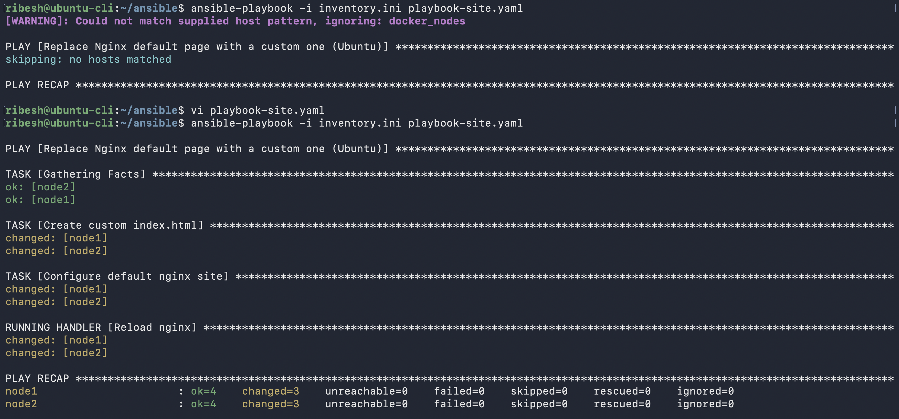
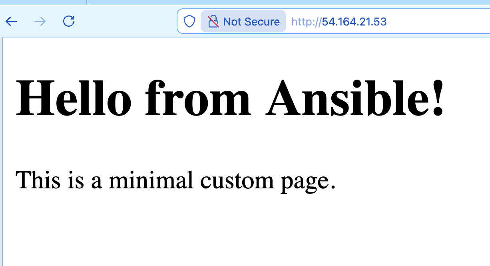

# Ansible

## 1. Install Ansible in Ubuntu
```sh
sudo apt update
sudo apt install ansible -y
ansible --version
```


## 2. Install Other Dependencies
```bash
sudo apt install sshpass
```

## 3. Generate SSH-Key Pairs for password less authentication

```bash
ssh-keygen

cat ~/.ssh/id_********.pub
```

#### Copy the contents to all the targeted EC2 instance `~/.ssh/authorized_keys`


## Working with Ansible file
```bash
mkdir ansible
cd ansible/
```

1. `inventory.ini `file
    ```sh
    vi inventory.ini
    ```

    ```ini
    [ec2_nodes]
    node1 ansible_host=******** ansible_port=22 ansible_ssh_common_args='-o StrictHostKeyChecking=no'
    node2 ansible_host=******** ansible_port=22 ansible_ssh_common_args='-o StrictHostKeyChecking=no'

    [ec2_nodes:vars]
    ansible_user=ubuntu
    ansible_become=true
    ```


2. `playbook-nginx.yml` file
    ```yaml
    - name: Install and run Nginx on Ubuntu EC2 nodes
    hosts: ec2_nodes
    become: true

    tasks:
        - name: Check connectivity
        ping:

        - name: Update apt cache
        apt:
            update_cache: yes
            cache_valid_time: 3600

        - name: Install nginx
        apt:
            name: nginx
            state: present

        - name: Ensure nginx is started and enabled
        service:
            name: nginx
            state: started
            enabled: yes
    ```

3. playbook-sites.yaml

    ```yaml
    - name: Replace Nginx default page with a custom one (Ubuntu)
    hosts: ec2_nodes
    become: true

    tasks:
        - name: Create custom index.html
        copy:
            dest: /var/www/html/index.html
            content: |
            <!DOCTYPE html>
            <html>
            <head>
                <title>My Custom Page</title>
            </head>
            <body>
                <h1>Hello from Ansible!</h1>
                <p>This is a minimal custom page.</p>
            </body>
            </html>
            owner: www-data
            group: www-data
            mode: '0644'

        - name: Configure default nginx site
        copy:
            dest: /etc/nginx/sites-available/default
            content: |
            server {
                listen 80 default_server;
                listen [::]:80 default_server;

                root /var/www/html;
                index index.html;

                server_name _;

                location / {
                    try_files $uri $uri/ =404;
                }
            }
        notify: Reload nginx

    handlers:
        - name: Reload nginx
        service:
            name: nginx
            state: reloaded
    ```


## Verify
```bash
ansible all -i inventory.ini -m ping
```



## Apply the ansible-playbook commands
```bash
ansible-playbook -i inventory.ini playbook-nginx.yaml 
ansible-playbook -i inventory.ini playbook-site.yaml 
```







